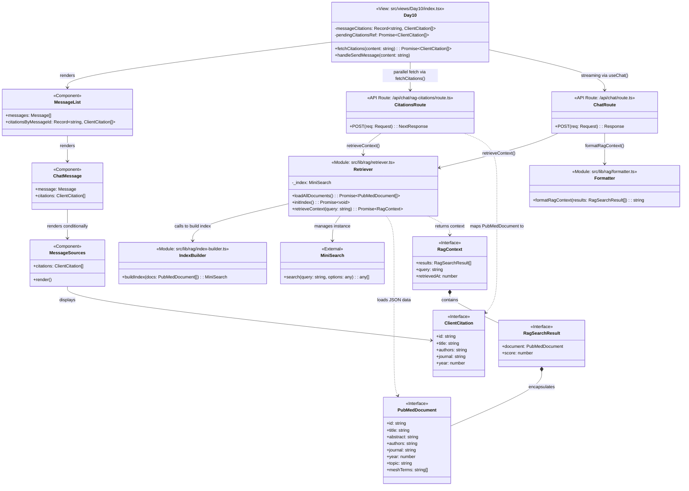

# Day 10 RAG Architecture

This document contains a class diagram illustrating the Retrieval-Augmented Generation (RAG) implementation for the Day 10 medical chat feature. It maps out the relationships between the frontend components, backend API routes, core RAG library modules, and the data types bridging them.

