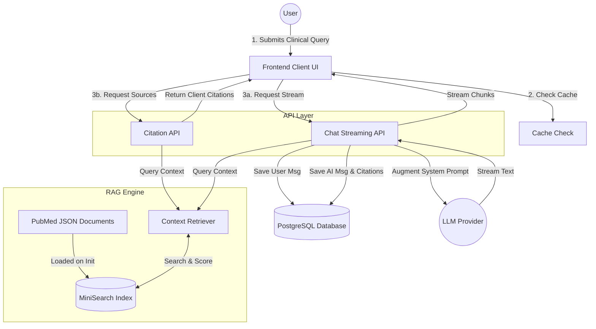
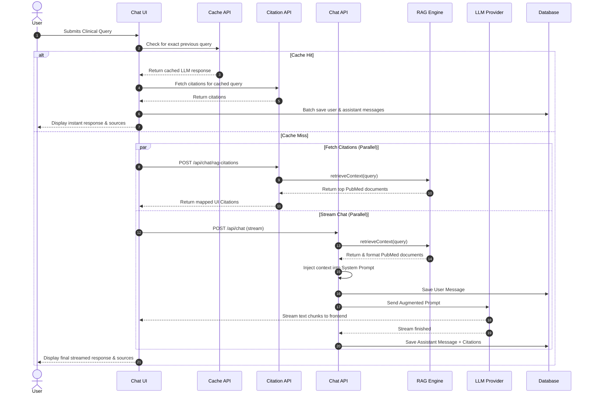

# Day 10 RAG Architectural Flow

This document contains high-level diagrams designed for team members and stakeholders to understand the architectural flow of the Retrieval-Augmented Generation (RAG) pipeline in the Day 10 medical chat application.

## 1. High-Level Architecture Flowchart
This diagram illustrates the macro-level relationships between the frontend, the API endpoints, the internal RAG engine, the database, and the external LLM provider.

***

## 2. Request Sequence Diagram
This sequence diagram shows the step-by-step lifecycle of a user query, demonstrating how parallel processing, caching, and database persistence are handled during the RAG workflow.

