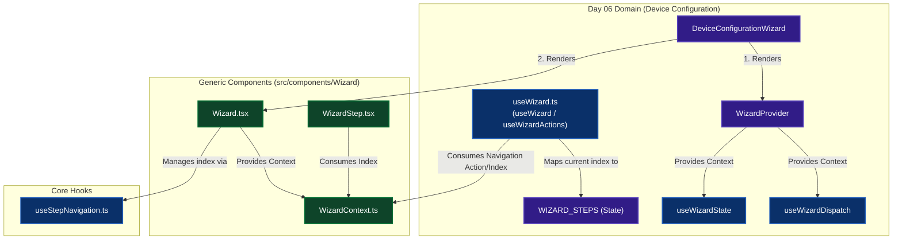

# Wizard Architecture Diagram

The frontend application uses a **Decoupled Headless Architecture**, separating domain-agnostic step navigation logic from domain-specific device configuration states.

Here is the relationship mapped out visually:

### Key Architectural Layers

1. **Top Level Orchestrator**: `DeviceConfigurationWizard` coordinates both the state provider (`WizardProvider`) and the visual wrapper (`Wizard.tsx`).
2. **Domain State Management (`WizardProvider`, `useWizardState`, `useWizardDispatch`)**: Stores and updates domain-specific configuration details like `deviceId` and `networkConfig` cleanly insulated from generic UI navigation logic.
3. **Generic Navigation Engine (`Wizard.tsx`, `useStepNavigation.ts`, `WizardContext.ts`)**: Represents the absolute generic "headless" core. It holds only the `currentStepIndex` and index navigation functions without knowing *what* is being configured.
4. **The Bridges (`useWizard.ts`)**: Serves as the integration point mapping the generic index (from `WizardContext.ts`) to the domain-specific `WIZARD_STEPS` string literals to determine exactly which step we are on (`SCAN`, `NETWORK`, etc.).
